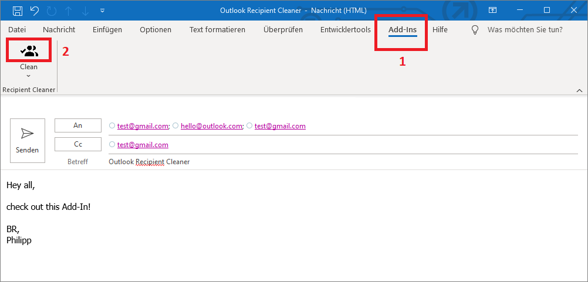

# Outlook Recipient Cleaner

An Outlook Add-In to clean up duplicated Outlook recipients.

## Features
Ever wondered how to remove duplicated participants out of your conversation in Outlook? Especially for big conversations this really can be a pain.
What sounds like a must have out of the box Outlook feature simply was not payed attention by the Microsoft developers.
Although are some *dirty* workarounds like copying the recipients to Excel to remove the duplicates or payed Add-Ins, this seems not be really satisfying.

This Add-In comes up with the solution: It removes all recipients of the *To*, *CC* and *BCC* fields by their address to leave only unique entries.

## Latest changes
You can find the latest and all other changes in the [changelog](CHANGELOG.md).

## Installation
Download a [release version](https://github.com/Fruchtzwerg94/OutlookRecipientCleaner/releases) and place its files in a persistant directory like *C:\ProgramData\Schmidt\OutlookRecipientCleaner*. Open Outlook and navigate to *File* --> *Options* --> *Add-Ins* where you are able to manage and add COM Add-Ins by clicking the corresponding _Go..._ button. After adding the plugin you are ready to go.
For more details see Microsofts documentation on how to [view, manage, and install add-ins in Office programs](https://support.microsoft.com/en-us/office/view-manage-and-install-add-ins-in-office-programs-16278816-1948-4028-91e5-76dca5380f8d).

### Compatibility
This Add-In requires at least *Outlook 2013* it was developed and tested with *Outlook 365 (Version 2202) 32 Bit*.

## Usage
The Add-In will show up in Outlooks Ribbon Bar tab *Add-Ins*. Klicking the *Clean* () button does all the magic.
It removes all duplicate recipients by their address. Recipients of the *To* field are priorized over recipients of the *CC* and *BCC* fields.

## License and credits
Outlook Recipient Cleaner is released under the [MIT License](LICENSE).

This Outlook Add-In integrates multiple other libraries and sources. Credits and thanks to all the developers working on these great projects:
* The plugin uses the [LoadingCircle](https://www.codeproject.com/articles/14841/how-to-write-a-loading-circle-animation-in-net) by Martin Gagne provided under the Code Project Open License.
* The plugin uses [Json.NET](https://www.newtonsoft.com/json) by James Newton-King provided under the MIT License.
* The plugin uses [Material Design Icons](https://materialdesignicons.com/) provided under the Pictogrammers Free License.

## Feedback, issues and contribution
Resonable feedback, issues and contributions are always very welcome. Feel free to bring in your points!

## Disclaimer
This source and the whole package comes without warranty. It may or may not harm your computer. Please use with care. Any damage cannot be related back to the author. The source has been tested on a virtual environment and scanned for viruses and has passed all tests.

## Personal Note
*I've created this software in my leasure time since I found no comparable solution to clean recipients seamlessly in Outlook. This software (with all its bugs) is not aiming to be an enterprise solution. It surely will not fulfill the needs of everybody. But it maybe is a nice little helper for some of you. I am always open for your reasonable feedback, issues and contributions. Feel free to contact me and have fun with it.*
